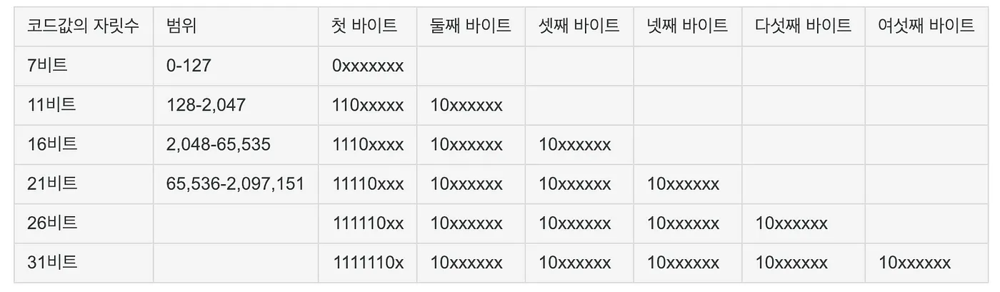

## chapter02

### 02-1 0과 1로 숫자를 표현하는 방법

정보 단위
// bit
컴퓨터의 정보 기본 단위는 bit입니다. 0또는 1밖에 이해하지 못하기 때문에 1bit는 두가지 상태를 표현할 수 있습니다.

예시) 
2bit 로 표현할 수 있는 경우의 수는 2^2으로 총 4개입니다.
3bit 는 2^3 총 8개 입니다.
n bit = 2^n


// byte
8개의 bit 를 묶은 단위로, bit 보다 한 단계 큰 단위입니다.
1byte는 256개 정보를 표현할 수 있습니다.
1KB(kilobyte)는 1000 byte입니다.

데이터의 단위는 비트를 제외하고는 1000개를 묶은 단위로 커지게 됩니다.

// 우리가 흔히 보는 웹브라우저, 워드 프로세서, 포토샵 등 우리가 실행하는 모든 프로그램은 수십만, 수백만 개 이상의 0 과 1로 이루어져 있습니다.

```
제가 회사 선임분에게서 당한 황당한 경험중에 컴퓨팅 메모리 관련 사용량을 구하는 공식의 1GB를 1000MB로 계산했다가 꾸중을 들었습니다. 하지만 책에 확실하게 명시되어있네요.
 1KB는1,024byte, 1MB는1,024kB..이런식으로표현하는것은잘못된관습입니다.이전단위를1.024개묶어표 현한단위는KB. MB. GB. TB가아닌KB. MiB. GiB. TiB입니다.
```
워드
정보의 단위중 워드(word)라는 단위도 있습니다.
CPU가 한번에 처리할 수 있는 데이터 크기를 의미하며
흔하게 볼 수 있는 윈도우 x32, x64비트 표기 되어있는 항목이 한번에 처리할 수 있는 비트의 크기입니다.

----

## 이진법 binary

이진법 binary
숫자가 1을 넘어가는 시점에서 올림
ex) 1(2) = 1 / 11(2) = 3 / 1110(2) = 8+4+2 = 14

이진수를 표현할 때는 수학적으로는 "1000(2)" 를 표현하고 코드상으로 표현할때는 "0b1000"로 표현합니다.

십진법 decimal
숫자가 9를 넘어가는 시점에서 올림

16진법
1-15까지 A~F를 할당하여 16진법 표기를 합니다.


### 이진수의 음수 표현

컴퓨터는 0,1 로 음수를 표현합니다. 2의 보수 two's complement 를 구해서 이를 음수로 간주하는 방법을 이용합니다.

어떤 수를 그보다 큰 2^n 에서 뺀 값을 의미합니다.
ex) 11(2) 의 보수 구하기
11(2) 의 큰수 3보다 큰 2^n 은 4 100(2)
100(2)-11(2) = 01(2)

// 더 쉽게 구하는 방법은 이진수의 0과 1을 바꾼후 +1 이 있습니다.

실제 컴퓨터에서는 플래그(flag)를 사용하여 음수와 양수를 구분합니다.
이유는 2의 보수 표현의 한계가 있기 때문입니다.
플래그에 대한 내용은 4장에 자세히 다룬다고 합니다.

### 16진법
0~9, A~F까지 정보를 표현 할 수 있습니다.
수학적 표기 15(16)
코드상 표기 0x15
16진수는 프로그래밍할때 흔히 볼 수 있는 표기입니다.


사용의 이유는 이진수를 16진수로 서로 변환하기 쉽기 때문입니다.
16진수에 표현되는 숫자 하나를 이진수로 표현하려면 4비트가 필요합니다. 2^4=16


16진수 한글자를 4자리의 2진수로 표현을 합니다.
반대로 2진수를 16진수로 표현하려면 4자리씩 끊어서 16진수의 숫자로 표현합니다.

----

## 2-2 0과 1로 문자를 표현하는 방법

문자 집합과 인코딩
컴퓨터가 인식하고 표현할 수 있는 문자의 모음을 문자 집합이라고 합니다.

문자를 0과 1로 변환하는 과정을 문자 인코딩
그의 반대는 문자 디코딩이라고 합니다.


### 아스키 코드
아스키 (American Standard Code for Information Interchage)
초창기 문자 집합 중 하나로 영어 알파벳, 아라비아숫자, 
일부 특수 문자를 저장하고 있습니다.

아스키 문자 집합은 7비트로 표현 2^7로 128개의 문자를 포현할 수 있습니다.
// 실제로는 하나의 아스키문자를 나타내기위해 8비트를 사용합니다. 그중 1비트는 패리트 비트 오류 검출을 위해 사용되는 비트이기 때문에 실제 7비트가 사용됩니다.


## 한글 표현
아스키는 말그대로 아메리칸을 위한 코드로 향후 다양한 언어와 문자를 표현하기에는 많이 부족했습니다.

한글 인코딩에는 두가지 방식 완성형, 조합형이 존재합니다.


### EUC-KR


한글을 2바이트에 표현할 수 있는 글자를 모아 만들어 사용하는 방식입니다.
특정 글자를 표현할 수 없는 상황이 발생합니다.
이를 해결하고자 CP949를 마이크로소프트에서 확장판으로 제작하였습니다.


### 유니코드와 UTF-8
모든 언어를 아우르는 문자 집합, 표준 인코딩 방식을 찾아 만들어진 것이 유니코드 집합 입니다.

UTF-8에 대해 알아보자
1바이트부터 4바이트까지의 인코딩 결과를 만들어 냅니다.
가변 인코딩 방식으로, 글자마다 byte 길이가 다르고 
'a' = 1byte, '가'=3byte 입니다.



•유니코드문자에부여된값의범위가0 부터007P(10)까지는1바이트로표현
• 유니코드문자에부여된값의범위가0080(16)부터07FF(10)까지는2바이트로표현
• 유니코드문자에부여된값의범위가0 800(16) 부터FFFF16까지는3바이트로표현
• 유니코드문자에부여된값의범위가10000(16)부터10FFFF(16)까지는4바이트로표현