# 7장 보조기억장치

## 보조기억장치 종류

보조기억장치는 대표적으로 하드디스크와 플래시메모리로 나눈다.

플래시 메모리는 USB, 메모리, SD카드, SSD와 같은 저장 장치를 말합니다.

### 하드디스크

하드디스크는 자기적인 방식으로 데이터를 저장하는 보조기억장치입니다.

이 때문에 디스크를 자기디스크 의 일종으로 지징하기도 합니다.

- 하듣지스크 구성요소
    - 플래터
        
        데이터가 저장되는 곳을 플래터라고 한다. 플래터는 자기 물질로 덮여있어 수많은  N극과 S극을 저장하고, 이는 0과 1의 역할을 수행합니다.
        
    - 스핀들
        
        플래터를 회전시키는 구성 요소를 스핀들이라고 합니다. 스핀들이 플래터를 돌리는 속도는 분당회전수를 나타난 RPM이라는 단위로 표현합니다.
        
    - 디스크암
        
        헤드를 이동시켜주는 도구
        
    - 헤드
        
        바늘
        

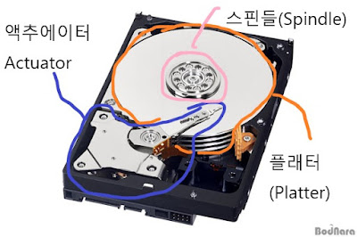

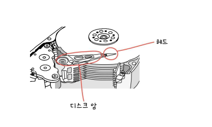

- 컴퓨터가 플래터에 데이터를 저장하는 방법
    
    
    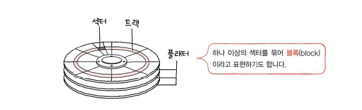
    

- 섹터
    - 하드디스크의 가장 작은 전송단위
    - 하나의 섹터는 일반적으로 512바이트정도의 크기를 갖지만 하드디스크에따라 차이가 있다.
    - 트랙의 한 조각을 섹터라고 부름
- 트랙
    - 플래털글 여러 동심원으로 나누었을 때 그중 하나의 원을 트랙이라고 부른다.
    - 디스크가 한번 회전할 동안 한 트랙을 읽어들일 수 있다

- 실린더
    - 여러 겹의 플래터 상에서 같은 트랙이 위치한 곳을 모아 연결한 논리적 단위

- 하드디스크의 성능
    
    하드디스크의 성능은 탐색 시간·회전 지연·전송률 등의 요소로 이루어진다.
    
    - **탐색시간**
        
         탐색 시간(seek time)은 디스크의 헤드가 원하는 데이터가 있는 트랙으로 움직이는 데 걸리는 시간
        
    - 회전 지연
        
        회전 지연(rotational delay)은 탐색 후 디스크가 회전해서 원하는 섹터가 헤드 아래에 위치하게 되는 데 걸리는 시간이다
        
    - 전송시간
        
        헤드가 원하는 위치에 도달한 후 비로소 실제로 데이터를 읽거나 쓸 수 있는데, 이 때 데이터를 읽거나 쓰는 속도가 전송률(transfer rate)이다.

### 플래시메모리

플래시메모리는 전기적으로 데이터를 읽고 쓸 수 있는 반도체 기반의 저장 장치입니다.

플래시메모리는 보조기억장치 범주에만 속한다기보다는 다양한 곳에서 널리 사용하는 저장 장치로 보는 것이 옳습니다. 주기억장치중 하나인 ROM에도 사용되고, 우리가 일성적으로 접하는 거의 모든 전자제품 안에 플래시 메모리가 내장되어있음.

- 플래시메모리 종류
    
    플래시 메모리(Flash Memory)는 반도체 칩 내부의 전자회로의 형태에 따라 직렬로 연결된 낸드 플래시와 병렬로 연결된 노어플래시로 구분된다. 우리가 주로 사용하는 메모리는  NAND플래시 메모리다
    
    - NAND (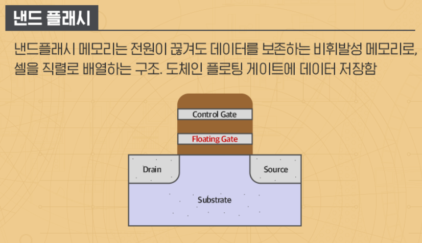)
        
        낸드 플래시는 저장 단위인 셀을 수직으로 배열하는 구조이기 때문에 좁은 면적에 많은 셀을 만들 수 있어 대용량화가 가능하다. (이론적으로 한 셀당 면적이 NOR형의 40% 수준)
        또한 데이터를 순차적으로 찾아가 읽기 때문에 노어플래시보다 읽기 속도는 느리지만 별도로 셀의 주소를 기억할 필요가 없어, 쓰기 속도는 훨씬 빠르다. 
        
        - NAND플래시 저장 원리
            
            CONTROL gate에 강한 전압을 가하게 되면, Source와 Drain 사이에 흐르는 전자가 tox(터널링 옥사이드)라고 부르는 절연층을 전자가 터널링해서 Floating gate에 쌓이게 됩니다. 그리고 이 전자는 정보를 저장하게 됩니다.
            
            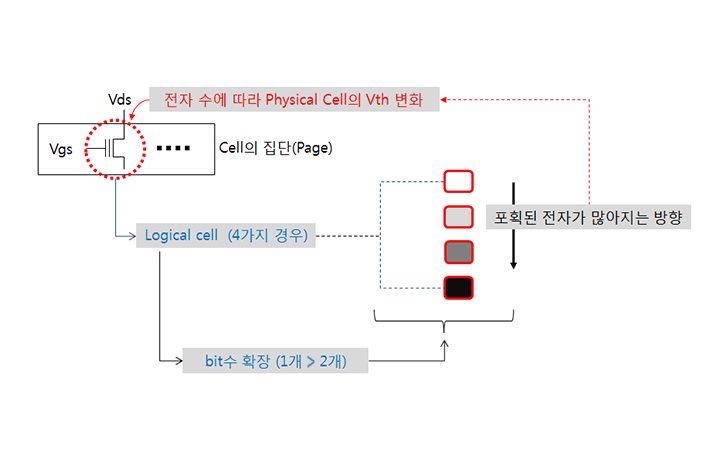
            
        - 셀
            - 셀이란, 플래시 메모리에서 데이터를 저장하는 가장 작은 단위.
            - 셀이 모여 MB, GB, TB 용량을 갖는 저장 장치가 됨
            - SLC타입, MLC타입, TLC타입이 있다. (QLC타입은 책에서 다루지 않음)
        
        - 셀 내에 bit 수를 확장한 개념
            
            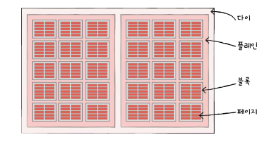
            
            | 구분  | SLC | MLC | TLC |
            | --- | --- | --- | --- |
            | 셀당 bit | 1bit | 2bit | 3bit |
            | 수명 | 길다 | 보통 | 짧다 |
            | 읽기/쓰기 속도 | 빠르다 | 보통 | 느리다 |
            | 용량대비 가격 | 높다 | 보통 | 낮다 |
            
        - 플래시 메모리 구성 단위
            
            셀 < 페이지 < 블록 < 플레인 < 다이로 구성된다.
            
            - 플래시메모리에서 읽기와 쓰기는 페이지 단위로 이루어진다.
            하지만 삭제는 블록단위로 이루어짐
            - 페이지는 Free상태(빈공간), Invalid(유효한데이터가 할당됨)상태, Valid(가비지데이터가 할당됨)상태로 세 개의 상태를 가질 수 있다.
            - 플래시메모리는 Valid상태인 페이지에는 새 데이터를 저장할 수 없다.
        - 가비지컬렉션
            
            블록에서 유효한 페이지(Valid상태)들을 새로운 블록으로 복사한 뒤 기존 블록을 삭제하는 기능으로, 가비지 데이터로 낭비되는 용량을 확보할 기능이다.
            

## RAID의 정의와 종류

### RAID의 정의

RAID는 주로 하드디스크와 SSD를 사용하는 기술로, 데이터의 안전성 혹은 높은 성능을 위해 여러개의 물리적보조기억 장치를 하나의 논리적 보조기억장치처럼 사용하는 기술을 의미합니다. 

### RAID의 종류

RAID를 구성하는 방법을 RAID 레벨이라고 표현하고, RAID레벨에는 대표적으로..,
RIAD 0, RIAD 2, RIAD 3, RIAD 4, RIAD 5, RIAD 6이 있고, 이로부터 파생된 RAID 10, RAID 50이 있습니다. 이들 중 가장 대중적인 RAID 레벨은 RAID 0, RAID 1, RAID 4, RAID 5, RAID 6입니다.

- RAID 0
    
    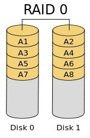
    
    Striping (스트라이핑) 이라고도 부르는 방식입니다.
    
    Striping (스트라이핑) 이라고도 부르는 방식입니다.
    
    RAID 0를 구성하기 위해서는 최소 2개의 디스크가 필요합니다. (min(N) == 2)
    
    RAID를 구성하는 모든 디스크에 데이터를 분할하여 저장합니다.
    
    전체 디스크를 모두 동시에 사용하기 때문에 성능은 단일 디스크의 성능의 N배 입니다.
    
    마찬가지로 용량 역시 단일 디스크의 용량의 N배가 됩니다.
    
    하지만 하나의 디스크라도 문제가 발생 할 경우 전체 RAID가 깨지는 불상사가 발생합니다.
    
    즉, 안정성은 1/N으로 줄어든다 할 수 있습니다.
    
    성능과 용량은 최대한으로 사용하는 대신, 안정성은 극악이라 할 수 있습니다.
    
    (즉 실제 서버 환경에서는 거의 사용하지 않는다고 봐야합니다.)
    
- RAID 1
    
    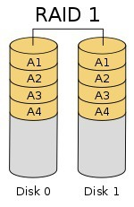
    
    Mirroring (미러링) 이라고도 부르는 방식 입니다.
    
    RAID 1을 구성하기 위해서는 최소 2개의 디스크가 필요합니다. (min(N) == 2)
    
    RAID 컨트롤러에 따라서 2개의 디스크로만 구성 가능할 수도,
    
    그 이상의 개수를 사용 하여 구성 할 수도 있습니다.
    
    RAID 1은 모든 디스크에 데이터를 복제하여 기록합니다.
    
    즉, 동일한 데이터를 N개로 복제하여 각 디스크에 저장합니다.
    
    때문에 여러 개의 디스크로 RAID를 구성해도, 실제 사용 가능한 용량은 단일 디스크의 용량과 동일합니다.
    
    Write 시엔 데이터를 복제하여 기록하기 때문에, RAID 컨트롤러가 복제, 연산 하는 시간을 감안하면
    
    단일 디스크의 Write 성능보다 낮게 나올 수도 있습니다.
    
    하지만 Read 시엔 전체 디스크에서 읽어오기 때문에 단일 디스크의 N배의 성능이 나옵니다.
    
    그리고 RAID 1의 최대 강점은 안정성이 높다는 것 입니다.
    
    극단적으로, N-1개의 디스크가 고장나도 데이터 사용이 가능합니다.
    
    (단, 이런 상황이 발생 했을 떄는 빨리 데이터를 백업해 주어야 합니다.)
    
    안정성이 중요한 시스템에서 사용 할 수 있겠으나, 비용 문제로 인해 거의 사용하지 않습니다.
    

   

- RAID 2
    
   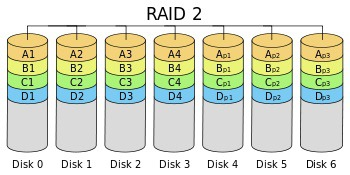
    
    현재는 사용하지 않는 RAID Level 입니다.
    
    bit 단위로 striping을 하고, error correction을 위해 [Hamming code](https://en.wikipedia.org/wiki/Hamming_code) 를 사용합니다.
    
    m+1개의 데이터 디스크와 m개의 패리티 디스크로 구성되는 것 같습니다. (즉 N == (m+1) + m)
    
    최소 3개의 디스크로 구성 가능합니다.
    
    그리고 1개의 디스크 에러 시 복구 가능합니다. (2개 이상의 디스크 에러 시 복구 불가능)
    
- RAID 3
    
    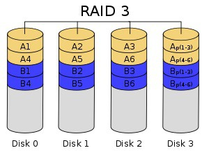
    
    현재는 사용하지 않는 RAID Level 입니다.
    
    Byte 단위로 striping을 하고, error correction을 위해 패리티 디스크를 1개 사용합니다.
    
    용량 및 성능이 단일 디스크 대비 (N-1) 배 증가합니다.
    
    Byte 단위로 striping 하기 때문에 너무 작게 쪼개져 현재는 사용하지 않는다고 합니다.
    
    최소 3개의 디스크로 구성 가능합니다.
    
    그리고 1개의 디스크 에러 시 복구 가능합니다. (2개 이상의 디스크 에러 시 복구 불가능)
    
- RAID 4
    
    
    
    현재는 (거의) 사용하지 않는 RAID Level 입니다.
    
    Block 단위로 striping을 하고, error correction을 위해 패리티 디스크를 1개 사용합니다.
    
    용량 및 성능이 단일 디스크 대비 (N-1) 배 증가합니다.
    
    최소 3개의 디스크로 구성 가능합니다.
    
    그리고 1개의 디스크 에러 시 복구 가능합니다. (2개 이상의 디스크 에러 시 복구 불가능)
    
    Block 단위로 striping 하는 것은 RAID 5, RAID 6와 동일하지만,
    
    패리티 코드를 동일한 디스크에 저장하기 때문에,
    
    패리티 디스크의 사용량이 높아 해당 디스크의 수명이 줄어든다고 합니다.
    
    RAID 4의 단점을 개선시킨 것이 RAID 5 입니다.
    
- RAID 5
    
    
    
    제일 사용 빈도가 높은 RAID Level 입니다.
    
    Block 단위로 striping을 하고, error correction을 위해 패리티를 1개의 디스크에 저장하는데,
    
    패리티 저장 하는 디스크를 고정하지 않고, 매 번 다른 디스크에 저장합니다.
    
    (RAID 4와 RAID 5의 그림을 비교해 보시면 이해 될겁니다.)
    
    용량 및 성능이 단일 디스크 대비 (N-1) 배 증가합니다.
    
    최소 3개의 디스크로 구성 가능합니다.
    
    그리고 1개의 디스크 에러 시 복구 가능합니다. (2개 이상의 디스크 에러 시 복구 불가능)
    
    RAID 0에서 성능, 용량을 조금 줄이는 대신 안정성을 높인 RAID Level이라 보시면 됩니다.
    
- RAID 6
    
    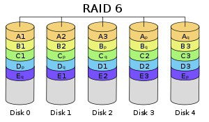
    
    RAID 5에서 성능, 용량을 좀 더 줄이고, 안정성을 좀 더 높인 RAID Level 입니다.
    
    Block 단위로 striping을 하고, error correction을 위해 패리티를 **2개**의 디스크에 저장하는데,
    
    패리티 저장 하는 디스크를 고정하지 않고, 매 번 다른 디스크에 저장합니다.
    
    용량 및 성능이 단일 디스크 대비 (N-2) 배 증가합니다.
    
    최소 4개의 디스크로 구성 가능합니다.
    
    그리고 2개의 디스크 에러 시 복구 가능합니다. (3개 이상의 디스크 에러 시 복구 불가능)
    
    RAID 5에서 성능, 용량을 조금 줄이는 대신 안정성을 높인 RAID Level이라 보시면 됩니다.
    
    조금 더 안정성을 높여야 하는 서버 환경에서 주로 사용합니다.