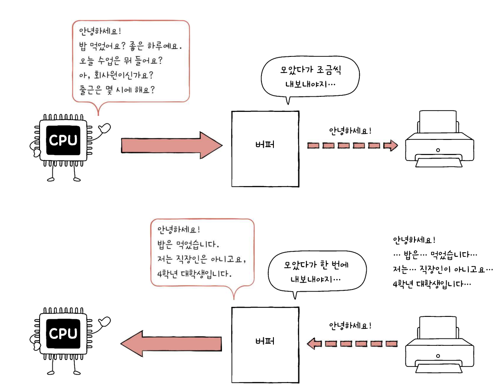

# 장치 컨트롤러와 장치 드라이버

# 장치 컨트롤러

### 입출력 장치가 앞서 학습한 컴퓨터 부품보다 다루기 까다로운 이유

**1) 입출력 장치의 종류가 너무 많다**

→ 키보드, 모니터, USB 메모리 , CD-ROM, SSD, 마우스, 프린터

**2) 일반적으로 CPU와 메모리의 데이터 전송률은 높지만 입출 장치의 데이터 전송률은 낮음**

→ 컴퓨터 부품과 입출력 장치의 전송 속도가 다름에 따라 통신이 어려워짐, 이를 위해 **장치 컨트롤러**를 사용


>💡 **장치 컨트롤러란?**
입출력 제어기나 입출력 모듈 등 다양한 이름으로 불리우게 됨
장치 컨트롤러는 데이터 레지스터, 상태 레지스터, 제어 레지스터 3가지를 기억하자
>
>1) CPU와 입출력장치 간의 통신 중개 
>2) 오류 검출
>3) 데이터 버퍼링등의 역할을 맡음 → 버퍼링이란 전송률이 서로 다른 데이터를 버퍼라는 임시 저장 공간에 저장하여 전송률을 비슷하게 맞추는 방법
>
>

</br>

# 장치 드라이버

### 장치 드라이버란?

장치 컨트롤러의 동작을 감지하고 제어함으로써 장치 컨트롤러가 컴퓨터 내부와 정보를 주고 받을 수 있게하는 소프트웨어

소프트웨어임에 따라 메모리에 명령어가 저장됨 

[예시] 간단 키보드 드라이버 

```c
#include <stdio.h>

// 키보드 드라이버의 초기화
void initializeKeyboardDriver() {
    // 키보드 드라이버 초기화 로직
    printf("Keyboard driver initialized.\n");
}

// 키 입력 이벤트 처리
void handleKeyPress(int keyCode) {
    // 키 입력 처리 로직
    printf("Key pressed: %d\n", keyCode);
}

// 키보드 드라이버의 종료
void closeKeyboardDriver() {
    // 키보드 드라이버 종료 로직
    printf("Keyboard driver closed.\n");
}

int main() {
    // 키보드 드라이버 초기화
    initializeKeyboardDriver();

    // 키 입력 이벤트 처리 예시
    int key;
    printf("Enter a key code (0 to exit): ");
    scanf("%d", &key);

    while (key != 0) {
        handleKeyPress(key);
        printf("Enter a key code (0 to exit): ");
        scanf("%d", &key);
    }

    // 키보드 드라이버 종료
    closeKeyboardDriver();

    return 0;
}
```


>💡 **우분투 기준 /dev/input/eventX 디렉토리를 통해 키보드 이벤트를 핸들링 할 수 있음**

</br>

# 장치 컨트롤러와 CPU가 정보를 주고 받는 방법

## 프로그램 입출력

프로그램 속 명령어로 입출력 장치를 제어하는 방법

1) 제어 레지스터에 진행하고자 하는 명령을 보냄

2) 상태 레지스터를 통해 입출력 장치의 상태를 확인

3) 장치의 상태가 명령어를 진행 할 수 있을 때 백업할 메모리 정보를 데이터 레지스터에 저장


>💡 CPU는 장치 입출력 레지스터의 주소를 어떻게 아는가?
>* 메모리 맵 입출력 :** 메모리에 접근하기 위한 주소 공간과 입출력 장치에 접근하기 위한 주소 공간을 하나의 주소 공간으로 간주 (같은 메모리에서 공간을 나누어 사용하겠다)<br>
→ **메모리 접근 명령어의 방식이 달라지지 않음**<br><br>
> *  고립형 입출력 : 메모리를 위한 주소 공간과 입출력 장치를 위한 주소 공간을 분리
제어의 버스의 역할이 두가지로 나뉘어 짐 (메모리, 입출력) <br>
→ **메모리 접근 명령어의 방식이 달라짐**

</aside>

## 인터럽트 기반 입출력

CPU가 다른 일을 하다가 입출력 장치에 의해 인터럽트를 발생하고 해당 내용을 처리하는 과정


>💡 여러 장치 컨트롤러가 인터럽트를 발생 시킬 경우 대부분 **순서대로 인터럽트를 처리를 하지만 우선순위에 의해 인터럽트 처리 루틴이 바뀔 수 있음(플래그 레지스터 속 정보가 NMI 일 경우)**
>
>* PIC (Programmeable Interrupt Controller): 해당 장비를 통해 우선순위를 반영하여 다중 인터럽트를 처리


## DMA 입출력

입출력 장치와 메모리가 CPU를 거치지 않고 상호작용할 수 있도록 하는 방식(해당 방식을 사용하기 위해 시스템 버스에 연결된 DMA 컨트롤러가 필요)

- DMA 입출력 과정
    
    
    


>💡 **입출력 버스**
시스템 버스를 입출력 서비스 루틴을 처리하기위해 점유함에 따라 **CPU가 처리 할 수 있는 루틴이 적어짐** 이에 따라 버스를 분리하여 **입출력 루틴만을 처리하기 위한 버스를 구축<br><br>
[ex] PIC Express 버스 , PCI 서브**
>
>
