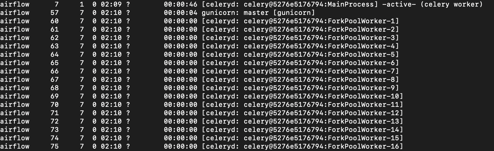

# 11. CPU 스케쥴링

# 지난 주 숙제

```go
Airflow worker 동작은 아래와 같이 이루어진다
'Celery worker에 의해 생성되어진 worker pool process에 task process가 할당되어 진행'
이와 같을 때 프로세스가 forke되어있는 화면을 캡처하라
```

## container에서 확인하기

- procps 패키지 설치하기
    
    apache/airflow에서 제공하는 docker image에는 **procps 패키지가 포함되어 있지 않아 ps 명령어를 사용할 수 없음**
    
    ```bash
    #docker container를 root 권한으로 접속
    docker exec -itu 0 {airflow-workek-container} /bin/bash
    
    #apt 패키지 매니저 업데이터
    apt-get update
    #procps 패키지 설치
    apt-get install procps
    ```
    

- celery worker가 실행되는 PID를 확인하기
    
    celery worker 가 실행되는 pid는 ‘/opt/airflow/airflow-worker.pid’ 내용으로 남게 됩니다
    
    ```bash
    cat /opt/airflow/airflow-worker.pid
    ```
    

- ps 명령어를 통해 할당되어진 celery worker pool 확인하기
    
    ```bash
    ps -ef |grep 7
    ```
    
    
    

- celery worker pool 에 forke 되어진 task 모습 확인하기
    
    ```bash
    # ForkPoolWorker3 번에 할당되어진 task를 확인하기 위해 pid 62번을 토대로 검색 진행
    ps -ef |grep 62
    ```
    
    
    

# CPU 스케쥴링

- **스케쥴링이란?**
    
    운영체제가 프로세스들에게 공정하고 합리적으로 CPU 자원을 배분하는 것을 의미
    

- **프로세스 종류**
    
    
    | 이름 | 설명 | 특징 | 우선순위 |
    | --- | --- | --- | --- |
    | 입출력 집중 프로세스 | 입출력 작업이 많은 프로세스 | 대기 상태에 더 많이 머무름 | 낮음 |
    | CPU 집중프로세스 | 연산,컴파일, 그래픽 처리 작업이 많은 프로세스 | 실행 상태에 더 많이 머무름 | 높음 |

**왜 입출력 집중 프로세스의 우선순위가 낮을까?**

- 왜?
    
    입출력 요청이 왔을 경우 process는 해당 요청을 진행시키고 장치에서 완료되기까지 대기 상태로 진행 되어짐 장치에 의해 인터럽트 요청이 되고 나서 실행됨에 따라 cpu 점유하는 시간이 적음
    
    
    

# 스케쥴링 큐

- 스케쥴링 큐란?
    
    PCB에 우선순위가 적혀있지만 CPU를 사용할 다음 프로세스를 찾기 위해 운영채제가 모든 프로세스를 검토하는 것은 비효율적 따라서 CPU를 사용하고자하는 프로세스를 순차적으로 queue에 넣어 관리, 해당 queue를 스케쥴링 큐라고 칭함
    
    
    💡 PCB 란?<br>
    프로세스 제어 블록(Process Control Block, 줄여서 PCB)은 **특정한 프로세스를 관리할 필요가 있는 정보를 포함하는 운영 체제 커널의 자료 구조**이다. 작업 제어 블록(Task Control Block, 줄여서 TCB) 또는 작업 구조라고도 한다
    
    
    

- 큐의 종류
    
    
    | 이름 | 설명 |
    | --- | --- |
    | 준비 큐 (ready queue) | CPU를 이용하고자 하는 프로세스들이 담기는 queue |
    | 대기 큐 (wating queue) | 입출력 장치를 이용하기 위해 대기 상태에 접어든 프로세스들이 담기는 queue |
    

# 선점형과 비선점형 스케쥴링

## 선점형 스케쥴링

- 선점형 스케쥴링이란?
    
    프로세스가 CPU를 비롯한 자원을 사용하고 있더라도 운영채제가 프로세스로부터 자원을 강제로 빼앗아 프로세스에 할당할 수 있는 스케쥴링 방식을 의미
    
- 예제
    
    프로세스마다 정해진 시간만큼 CPU를 사용하고 정해진 시간을 모두 소비하여 타이머 인터럽트가 발생하면 운영채제가 해당 프로세스로 부터 CPU 자원을 빼앗아 다음 프로세스에 할당
    
- 단점
    
    프로세스가 언제든 끼어들 수 있는 스케줄링 방식으로 인해 문맥교환 과정에서 오버헤드가 발생
    

## 비선점형 스케쥴링

- 비선점형 스케쥴링이란?
    
    하나의 프로세스가 자원을 사용하고 있다면 그 프로세스가 종료되거나 스스로 대기 상태에 접어들기 전까진 다름 프로세스가 끼어들 수 없는 스케줄링
    
    
    
    프로세스 멈춰!!!!!
    

- 단점
    
    하나의 프로세스가 긴 작업을 진행할 경우 추후의 작업은 무조건적으로 기다릴 수 밖에없음
    

# CPU 스케쥴링 알고리즘

## 선입 선처리 스케쥴링 (FCFS)

단순하게 준비 큐에 삽입된 순서대로 프로세스들을 처리하는 비선점형 스케쥴링 방식

💡 호위효과</br>
앞의 작업이 모두 끝나기 까지 기다려야하는 현상
[ {a:17ms}, { b: 5ms }, { c:2s } ] 와 같은 queue가 있을 때 c 작업이 실행 되기까지 총 22ms가 걸리게됨


## 최단 적업 우선 스케쥴링(SJF 스케쥴링 shortest job first)

호위 효과를 방지하기위해 가장 짧은 CPU 사용 시간을 가진 프로세스를 먼저 실행 시키는 스케쥴링


## 라운드 로빈 스케쥴링(Round robin scheduling)

선입 선출 스케쥴링에서 타임 슬라이스라는 개념이 더해진 스케쥴링 방식, 선점형 스케쥴링 방식 중  하나
잦은 문맥교환으로 인해 CPU에 부하가 생길 수 있음


💡 타임 슬라이스란?</br>
각 프로세스가 CPU를 사용할 수 있는 정해진 시간을 의미합니다


## 최소 잔여 시간 우선 스케쥴링(Shortest Remaining Time)

최단 작업 우선 스케줄링 알고리즘과 라운드 로빈 알고리즘을 합친 스케쥴링 방식

최소 잔여 시간 우선 스케줄링 하에서 프로세스들은 정해진 타임 슬라이스 만큼 CPU를 사용하되 다음 프로세스로는 남아있는 작업 시간이 가장 적은 프로세스가 선택

## 우선순위 스케쥴링

프로세스들에 우선순위를 부여하고 가장 높은 우선순위를 가진 프로세스를 실행

앞에서 말한 ‘최단 작업 우선 스케줄링’, ’최소 잔여 시간 우선 스케줄링’,을 넓은 개념으로 포함하고 있음
기아 현상을 초례할 수 있다는 단점이 존재


💡 기아 현상이란?</br>
우선 순위가 높은 프로세스들에 의해 연기되어 프로세스가 실행되지 못하는 현상


해결하기 위한 기법으로 **에이징**이 존재 : 오랫동안 대기한 프로세스의 우선순위를 점차 높이는 방식


## 다단계 큐 스케쥴링

우선순위 스케줄링의 발전 된 형태이며 우선순위별로 준비 큐를 여러 개 사용하는 스케줄링 방식, 가장 높은 큐에 있는 프로세스들을 먼저 처리 후 우선순위가 가장 높은 큐가 비었을 때 그 다음 우선순위 큐에 있는 프로세스들을 처리


## 다단계 피드백 큐 스케쥴링

다단계 큐 스케줄링의 발전된 형태 앞서 설명한 다단계 큐 스케쥴링에서는 큐 사이를 이동할 수 없었기 때문에 우선순위가 낮은 프로세스는 계속 연기될 여지가 있음 → 큐를 이동함으로써 해당 문제를 해결

- 순서
    
    1) 다단계 스케줄링에서 새로 준비 상태된 프로세스가 존재한다면 우선순위가 가장 높은 큐에 적재
    
    2) 일정 시간(타임 슬라이스)동안 해당 프로세스를 실행
    
    3) 실행이 끝나지 않을 경우 다음 우선순위 큐에 삽입되어 실행
    
    4) 1,2,3 항목을 반복
    


# 많이 사용하는 운영채제의 스케쥴링 알고리즘

- **linux**
    1. Completely Fair Scheduler (CFS): CFS는 리눅스 커널 2.6.23 버전부터 도입된 기본 스케줄러로, 프로세스의 공정한 할당을 목표로 합니다. 가상 레드-블랙 트리를 사용하여 가장 적은 가중치를 가진 프로세스에 CPU를 할당합니다
    
    [CFS Scheduler — The Linux Kernel  documentation](https://www.kernel.org/doc/html/latest/scheduler/sched-design-CFS.html)
    
    1. Real-Time Scheduling: 리얼타임 프로세스를 위한 스케줄링 알고리즘으로, 정적 우선순위나 동적 우선순위 방식으로 CPU를 할당합니다. 리얼타임 프로세스는 정확한 응답 시간이나 우선순위에 따라 작업을 처리해야 하는 경우 사용됩니다.
    2. Deadline Scheduling: 데드라인이 있는 작업을 위한 스케줄링 알고리즘으로, 작업의 마감 시간에 따라 우선순위를 부여하고 스케줄링합니다. 마감 시간을 지키는 것이 주요 목표입니다.
    
    [Deadline Task Scheduling — The Linux Kernel  documentation](https://www.kernel.org/doc/html/latest/scheduler/sched-deadline.html)
    
    1. Completely Fair Queuing (CFQ): 디스크 I/O 스케줄링을 위한 알고리즘으로, 입출력 요청을 공정하게 처리하기 위해 사용됩니다. 요청들을 여러 큐에 할당하고 각 큐에서 공정한 할당을 수행합니다.
    
- **window**
    1. Multi-Level Feedback Queue (MLFQ): MLFQ는 Windows의 기본 스케줄링 알고리즘입니다. 이 알고리즘은 프로세스를 우선순위에 따라 여러 개의 큐에 배치하여 스케줄링합니다. 우선순위가 낮은 프로세스에게도 충분한 실행 시간을 할당하며, 우선순위를 동적으로 조정합니다.
    2. First-Come, First-Served (FCFS): FCFS는 프로세스가 도착한 순서대로 실행을 처리하는 가장 간단한 스케줄링 알고리즘입니다. 도착한 순서대로 처리되므로 특정한 우선순위를 고려하지 않습니다.
    3. Round Robin (RR): RR은 프로세스에 일정한 시간 슬라이스를 할당하고, 할당된 시간이 지나면 다음 프로세스로 전환하는 방식으로 동작하는 스케줄링 알고리즘입니다.
    4. Priority Scheduling: 우선순위에 기반하여 프로세스를 스케줄링하는 알고리즘입니다. 우선순위가 높은 프로세스가 먼저 실행되며, 동일한 우선순위를 가진 프로세스 간에는 FCFS 또는 RR 등의 알고리즘을 적용할 수 있습니다.